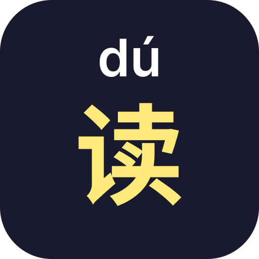

<p align="center"></p>

<h1 align="center">Dusubs</h1>
<p align="center">A Firefox extension that overlays Chinese and Japanese subtitles with annotations on YouTube and Bilibili, plus a companion website at <a href="https://www.dusubs.com">dusubs.com</a> for flashcard review.</p>

---

## What it looks like

The extension renders a floating overlay directly on the video. Chinese subtitles show **pinyin** above each character via HTML5 `<ruby>` tags (powered by `pinyin-pro`). Japanese subtitles show **furigana** (hiragana readings) above each character (powered by `kuromoji`). A second track — e.g. English — can be shown below simultaneously. Hover any word to see its reading and definition; click to save it.

## Features

### Extension

- **Chinese & Japanese** — pinyin for Chinese; furigana for Japanese
- **Dual-track subtitles** — pick any two tracks from the video's available captions independently
- **Hover to look up** — hover any word to see its reading and dictionary definitions in a tooltip
- **One-tap save** — click a word to save it (with sentence context) to your word list
- **Pinyin / furigana toggle** — hide annotations to test yourself, reveal on demand
- **Per-track colour** — white, yellow, pink, blue, or green per track
- **Font scale & position** — resize and reposition the overlay with sliders
- **Stroke / Window / Shadow** — visual style toggles for readability
- **YouTube & Bilibili** — works on both platforms

### Website — [dusubs.com](https://www.dusubs.com)

- **Saved word dashboard** — browse and manage words you've saved while watching
- **Flashcard study** — review saved words as flippable flashcards
- **Leitner spaced repetition** — cards are sorted into 5 boxes with intervals of 1, 2, 4, 8, and 16 days; correct answers promote a card, wrong answers reset it to box 1
- **Language filter** — study Chinese and Japanese words separately or together
- **Export** — download your word list in Anki or Quizlet format

## How it works

| File | World | Role |
|---|---|---|
| `youtube-main.js` | MAIN | Accesses YouTube's internal player API to read available caption tracks and their URLs |
| `bilibili-main.js` | MAIN | Intercepts Bilibili's subtitle API responses |
| `pinyin-pro.js` | ISOLATED | Bundled [pinyin-pro](https://github.com/zh-lx/pinyin-pro) library; exposes `pinyinPro` on `globalThis` |
| `kuromoji.js` | ISOLATED | Bundled kuromoji tokeniser for Japanese morphological analysis and reading extraction |
| `content.js` | ISOLATED | Renders the subtitle overlay; fetches and parses cues; annotates characters with `<ruby>` tags |
| `background.js` | Service worker | Cross-origin fetch proxy for subtitle files; passively intercepts subtitle requests via `webRequest` |
| `popup.html` / `popup.js` | Extension popup | Settings UI — track selection, colours, scale, position, toggles |
| `web/` | — | Next.js companion site ([dusubs.com](https://www.dusubs.com)) |

### Chinese subtitles

Subtitles are fetched in JSON3 format (YouTube's internal timed-text format) and parsed directly in the extension. An XML fallback handles older-format responses. The overlay syncs to `video.currentTime` at ~12 fps. Characters are annotated at render time using `pinyin-pro`; hover tooltips pull definitions from the bundled CC-CEDICT word list (`cedict.json`).

### Japanese subtitles

Japanese uses [kuromoji](https://github.com/takuyaa/kuromoji) for morphological analysis and furigana extraction. Because kuromoji's browser build loads dictionary files via `XMLHttpRequest` and doesn't know how to reach `moz-extension://` URLs, a small XHR shim is used:

1. All 12 kuromoji `.dat.gz` dictionary files are pre-fetched via `browser.runtime.getURL` and converted to blob URLs.
2. `XMLHttpRequest.prototype.open` is temporarily monkey-patched so any kuromoji dict request is transparently redirected to the corresponding blob URL.
3. Once kuromoji finishes building its tokeniser, the original `open` is restored and the blob URLs are revoked.

## Installation

This extension uses Manifest V2 and the `browser.*` WebExtensions API. It runs in **Firefox** without any changes.

**Chrome/Edge** — requires [webextension-polyfill](https://github.com/mozilla/webextension-polyfill) or manual replacement of `browser.*` calls with `chrome.*`.

### Firefox (recommended)

Install from the Firefox Add-ons store: **[addons.mozilla.org/firefox/addon/dusubs/](https://addons.mozilla.org/firefox/addon/dusubs/)**

### Firefox (development)

1. Clone or download this repo
2. Open `about:debugging` → **This Firefox** → **Load Temporary Add-on**
3. Select `manifest.json`

## Usage

1. Open a YouTube or Bilibili video that has captions
2. Click the extension icon
3. Select a **Top** track (e.g. Chinese or Japanese) and optionally a **Bottom** track (e.g. English)
4. Adjust scale, position, and style to taste
5. Hover any word to see its reading and definition; click to save it

The extension hides the site's native subtitles once its overlay is active. Switching both tracks to **Off** restores them.

Visit **[dusubs.com](https://www.dusubs.com)** to review your saved words as flashcards.

## Files

```
manifest.json           Extension manifest (MV2)
content.js              Subtitle overlay (isolated world)
youtube-main.js         YouTube player API access (main world)
bilibili-main.js        Bilibili subtitle intercept (main world)
background.js           Fetch proxy + webRequest intercept
popup.html / popup.js   Settings popup
pinyin-pro.js           Bundled pinyin-pro library (Chinese)
kuromoji.js             Bundled kuromoji tokeniser (Japanese)
cedict.json             CC-CEDICT word list for Chinese definitions and pinyin correction
ja-dict.json            Japanese dictionary for hover definitions
dict/                   Kuromoji binary dictionary files (*.dat.gz)
scripts/
  make-dict.js          Downloads CC-CEDICT and generates cedict.json
web/                    Next.js companion site (dusubs.com)
```

## Credits

- Pinyin computation by [zh-lx/pinyin-pro](https://github.com/zh-lx/pinyin-pro)
- Japanese tokenisation by [kuromoji](https://github.com/takuyaa/kuromoji)
- Chinese definitions from [CC-CEDICT](https://cc-cedict.org/wiki/)

### Also try the [Zhongwen](https://addons.mozilla.org/en-US/firefox/addon/zhongwen/) extension by Christian Schiller