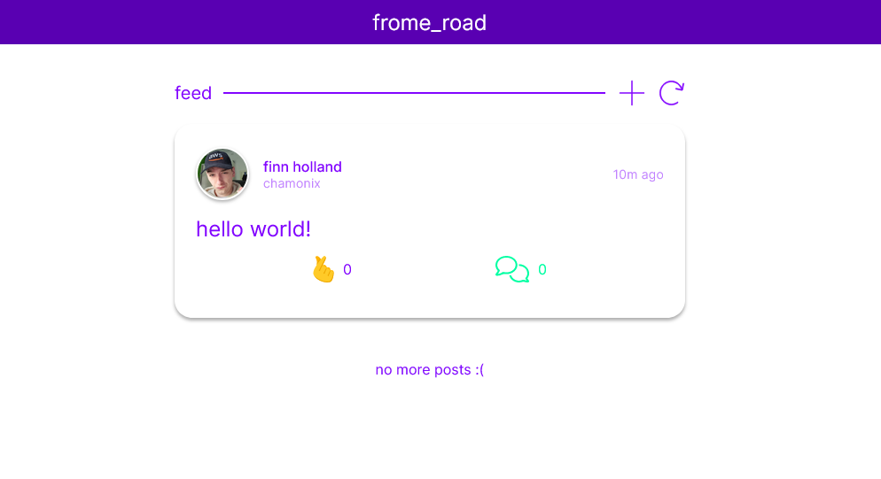

# frome_road

<p align="center"></p>

A full-stack social platform built as a community space for employees of [Lot Fourteen](https://lotfourteen.com.au/) — a technology and innovation precinct in Adelaide. Users can post, comment, vote, and follow trending members across a feed with dark mode, mobile support, and real-time trending.

Built solo as a deep-dive into full-stack development, cloud infrastructure, and AWS services from the ground up.

---

## Tech Stack

| Layer | Technology |
|---|---|
| Frontend | React 18, TypeScript, Redux Toolkit, React Router v6 |
| Backend | Node.js, Express 4 |
| Database | MySQL 8 (Aurora Serverless v2 in production) |
| Auth | JWT (HS256), Argon2 password hashing |
| File Storage | AWS S3 via Multer-S3 |
| Email | AWS SES via Nodemailer |
| Hosting (UI) | AWS Amplify |
| Hosting (API) | AWS ECS Fargate behind an Application Load Balancer |
| DNS / TLS | AWS Route 53 + ACM (HTTPS) |
| Infrastructure | Terraform (AWS provider ~5.0) |
| CI/CD | AWS CodePipeline + CodeBuild |
| Containerisation | Docker, Docker Compose |
| Security | CryptoJS (client-side field encryption), DOMPurify (XSS) |

---

## Features

- **Social feed** — create posts with optional image attachments (uploaded directly to S3)
- **Comments** — nested comment threads on posts
- **Voting** — upvote/downvote system per user-post pair
- **Trending** — hourly leaderboard of top 10 users, calculated via MySQL stored procedures and scheduled events
- **Auth flow** — email verification on signup, JWT-protected routes, password reset with 30-minute expiring codes
- **Profile pages** — avatar upload, interests/tags, recent activity
- **Infinite scroll** — paginated feed using React Infinite Scroll
- **Dark mode** — preference persisted in localStorage
- **Mobile responsive** — dedicated mobile components with burger menu navigation

---

## Architecture

```
┌─────────────────────────────────────────────┐
│                  AWS Cloud                  │
│                                             │
│  ┌───────────┐     ┌─────────────────────┐  │
│  │  Amplify  │────▶│  Application Load   │  │
│  │ (React)   │     │     Balancer        │  │
│  └───────────┘     └────────┬────────────┘  │
│                             │               │
│                    ┌────────▼────────────┐  │
│                    │   ECS Fargate       │  │
│                    │  (Express API)      │  │
│                    └────────┬────────────┘  │
│                             │               │
│              ┌──────────────┼──────────┐    │
│              │              │          │    │
│    ┌─────────▼──┐  ┌────────▼──┐  ┌───▼──┐ │
│    │ Aurora RDS │  │    S3     │  │ SES  │ │
│    │  MySQL 8   │  │ (images)  │  │(mail)│ │
│    └────────────┘  └───────────┘  └──────┘ │
│                                             │
│  Secrets Manager · ECR · Route 53 · ACM     │
└─────────────────────────────────────────────┘
```

**Frontend** is hosted on Amplify with CI/CD triggered on push to the connected GitHub branch.

**Backend** runs as a Docker container in ECS Fargate — chosen for minimal ops overhead and horizontal scaling without managing EC2 instances.

**Database** is Aurora MySQL Serverless v2 (scales between 0.5–2 ACU), providing cost efficiency at low traffic and automatic scaling under load.

**Infrastructure** is fully defined in Terraform with remote state stored in S3. The CodeBuild pipeline builds the Docker image, pushes it to ECR, then runs `terraform apply` to update the ECS task definition in one pipeline.

---

## Local Development

### Prerequisites

- Node.js 18+
- MySQL 8 (via [MySQL Installer](https://dev.mysql.com/downloads/mysql/) or Docker)

### 1. Clone

```bash
git clone https://github.com/finnholland/fromeroad.git
cd fromeroad
```

### 2. Database

**Option A — Docker Compose (recommended)**

```bash
cp .dev.env.example .dev.env  # fill in values
docker compose up -d
```

**Option B — Local MySQL**

1. Install MySQL 8 and open MySQL Workbench
2. Connect to `localhost` as `root`
3. Import `sql/empty_with_users.sql` via Server > Data Import

### 3. API

Create `api/.env`:

| Variable | Value |
|---|---|
| `SES_KEY` | AWS SES access key |
| `SES_SECRET` | AWS SES secret key |
| `S3_KEY` | AWS S3 access key |
| `S3_SECRET` | AWS S3 secret key |
| `RDS_DB` | `localhost` |
| `RDS_USER` | `admin_fromeroad_local` |
| `RDS_PASSWORD` | `abc123` |
| `JWT_SECRET` | output of `npm run crypto` |
| `CRYPTO_KEY` | output of `npm run crypto` |
| `ENV` | `local` |

> To skip S3, swap `multer-s3` for `multer` in `api/routes/image.js` and `api/routes/posts.js`.

```bash
npm run api
```

### 4. Frontend

```bash
cd web && npm i && cd ..
npm run web
```

In `web/src/constants.ts`, set:
```ts
const API = API_URLS.local;
```

Then visit [http://localhost:3000](http://localhost:3000) and verify the API is reachable at [http://localhost:8080](http://localhost:8080).

---

## AWS Deployment

Full infrastructure is provisioned with Terraform. The steps below cover the one-time manual setup in the AWS console before `terraform apply` can manage everything.

### IAM

Create a `terraform_user` with programmatic access and generate two access keys (keep one in reserve for rotation). If using the CodePipeline CI/CD:

- Create `codepipeline-execution-role` and attach `terraform/policies/codepipeline-execution-policy.json`
- Let CodePipeline auto-generate the `codebuild-role`, then attach `terraform/policies/codebuild-execution-policy.json` and `AmazonEC2ContainerRegistryReadOnly`

> If `terraform apply` errors with a parameter name validation message, your access key likely contains a disallowed character — rotate it.

### Secrets Manager

Create a secret of type "Other" with the following key-value pairs:

| Key | Value |
|---|---|
| `ACCESS_KEY` | terraform_user access key |
| `SECRET_KEY` | terraform_user secret key |
| `RDS_USER` | Aurora admin username |
| `RDS_PWD` | Aurora password |
| `DOCKER_USER` | Docker Hub username |
| `DOCKER_PWD` | Docker Hub password |
| `JWT_SECRET` | `npm run crypto` (from project root) |
| `CRYPTO_KEY` | `npm run crypto` (from project root) |
| `ENV` | `dev` / `prod` |

The ECS task definition reads these at runtime as environment variables — see `terraform/modules/ecs/main.tf`.

### ECR

Create a repository in ECR. Find and replace `fr_ecr_` (and the `env` suffix) in:
- `terraform/modules/ecs/main.tf`
- `buildspec.yml`
- `terraform/policies/terraform_policy`

### S3

**State bucket (private):**
```bash
terraform init \
  -var="ACCESS_KEY=<key>" \
  -var="SECRET_KEY=<secret>" \
  -backend-config="bucket=<bucket-name>" \
  -backend-config="region=ap-southeast-2" \
  -backend-config="key=prod.tfstate"
```

**Image bucket (public):**

Create a bucket with public access enabled, then attach:
- `terraform/policies/bucket-policy.json` (update bucket name and account ID)
- `terraform/policies/cors-policy.json` (update allowed origin to your Amplify URL or domain)

### Route 53 & Certificate Manager

Register or transfer a domain to Route 53 and create a hosted zone. Use Certificate Manager to issue a certificate for your domain — this is attached to the ALB for HTTPS termination.

### Amplify

Connect a new Amplify app to the GitHub repo, select your branch, and set the following environment variables:

| Variable | Value |
|---|---|
| `REACT_APP_API_KEY` | `https://<your-api-domain>.com` |
| `REACT_APP_CRYPTO_KEY` | Must match `CRYPTO_KEY` in Secrets Manager |
| `REACT_APP_S3_URL` | `https://<bucket>.s3.<region>.amazonaws.com` |

### RDS Snapshot

Aurora requires a snapshot for Terraform to restore from on first `apply`. To create one:

1. In VPC > Security Groups, add an inbound rule to `rds-sg` for your public IP on port 3306
2. Connect via MySQL Workbench using the RDS endpoint, `RDS_USER`, and `RDS_PWD`
3. Import `sql/prod/empty_with_users.sql` via Server > Data Import
4. In the RDS console, take a manual snapshot and note the name
5. Set `snapshot_identifier` in `terraform/modules/rds/main.tf` to that name

Future `terraform apply` runs will restore from this snapshot automatically.

### Deploy

```bash
terraform apply \
  -var="ACCESS_KEY=<key>" \
  -var="SECRET_KEY=<secret>"
```

Or trigger via the CodePipeline by pushing to the configured branch — CodeBuild builds the image, pushes to ECR, and applies Terraform automatically.

---

## Database Schema

Core tables: `users`, `posts`, `comments`, `postvotes`, `interests`, `userinterests`, `resetcodes`, `topten`, `trendingusers`

Notable MySQL features used:
- **Stored procedures** — `sp_updatetopten()`, `sp_weeklyreset()`, `sp_deletecodes()`
- **Scheduled events** — hourly trending recalculation, weekly post archival, expired code cleanup
- **Foreign keys with CASCADE DELETE** for referential integrity
- UTF8MB4 character set throughout

Schema files are in `sql/` with separate `dev/` and `prod/` backup directories.
